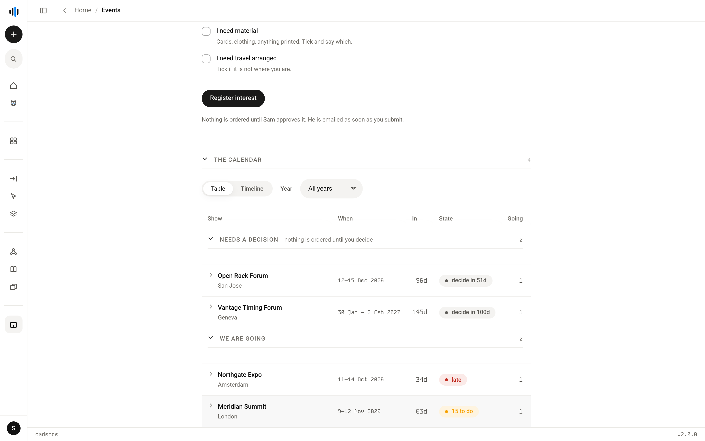
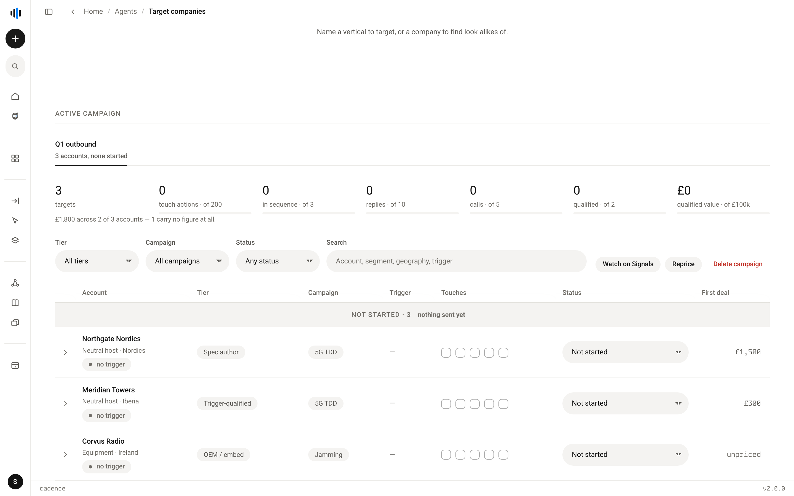

# Running without a model

Two of Cadence's subsystems reason about nothing and call no model at all. They
are not lesser agents and they are not waiting to become agents. They are the
parts of the platform where a model would make the answer worse.

This is a third category, and it is worth naming because the other two do not fit
it. The [eleven sales agents](README.md) are thin wrappers on the Owl Mind.
[Operations](operations.md) is part two — v1 code that predates the Mind and does
not run. These run, they are current, they are built on the studio design system,
and they will never reach the Mind because there is nothing there for it to do.

The argument is the one the platform already makes about
[lead scoring and campaign selection](architecture.md): a number a model could
move is a number worth less. A deadline counted backwards from a date is not an
opinion. A record of what happened to an account is not a judgement. Putting a
model in front of either would add latency, cost and doubt, and subtract
reproducibility.

---

## The event programme

`backend/agents/events/` · `/api/events` · `/work/events`

Which shows the company is going to, who is going, and what they still need.

A person registers interest in a show; that registration is gated
`proposed` → `approved` → `confirmed`, and each transition is a decision somebody
takes rather than a status that drifts. The show carries the case for going, the
cost of a stand where one is being taken, and a **decide-by date** of its own,
because the decision has a deadline before the show does.

**Deadlines are counted backwards from the show's own dates.** The checklist is
not a list somebody maintains; it is derived, phase by phase, from when the show
opens — so moving a show by a fortnight moves every deadline on it. Two lead
times govern the material: printed cards need a fortnight, anything bespoke needs
three weeks, and a show inside those windows is told so rather than being allowed
to quietly miss them.

**Role-scoped, as a predicate on the reads *and* the writes.** The programme owner
sees every show and both views; everybody else sees only the shows they are on —
confirmed, or their own proposal awaiting a decision. A show somebody cannot reach
answers "no such event" rather than refusing, because a refusal confirms it
exists.

**It writes a spreadsheet for the people who do not have accounts.** Four tabs —
a read-me, the shows, the requests, the checklist — written by Cadence and read by
whoever needs them. Every Cadence column is protected with a single editor;
order-by dates colour against today; the checkbox column is re-ranged on every
push, so a newly-approved show's lines can actually be ticked. The sheet is
written, never read back, with one exception: the ticks, which are the only thing
a reader can put into it.

*The running platform, on seeded demo data. Unlike the design-system screenshots, this is the software — the names and figures in it are invented.*

### Key files

| | |
|---|---|
| `store.py` | shows, registrations and their state machine, in SQLite |
| `checklist.py` | the phases, and what each one is due relative to the show |
| `requirements.py` | what a show needs, asked of the person rather than inferred |
| `sheet.py` | the shared spreadsheet: layout, protection, and the push |
| `notify.py` | the email a registration sends, over plain SMTP |
| `routes.py` | `/api/events`, and the scope predicate |

### Endpoints

| | |
|---|---|
| `GET /api/events` · `GET /{id}` | the calendar, scoped to the reader |
| `POST /api/events` | register interest, which proposes a show or joins one |
| `POST /{id}/approve` · `/decline` · `/attended` | the show's decisions |
| `POST /registrations/{id}/approve` · `/decline` | a person's decisions |
| `PATCH /{id}` · `POST /{id}/clone` · `DELETE /{id}` | maintain the record |

---

## The outbound tracker

`backend/agents/outbound/` · `/api/outbound`

One campaign's account list, and the goals it is measured against.

**The trail is the feature.** What has happened to a row — a touch fired, a status
moved — is appended, never rewritten. A tracker is the safety mechanism for a
manual sequence, and suppression depends on knowing what was already sent, so a
status that moves from `sequencing` to `dead` must not overwrite the fact that it
was ever in sequence. The row's `status` is a projection of that trail rather than
the truth itself. That is why this is SQLite and not a JSON blob: the artefact it
replaces recorded a touch as a `1` in an array, which cannot say when it happened
or who fired it.

**Pricing is a first-class refusal.** Each account is valued from a catalogue of
deal shapes as it lands. An unrecognised shape leaves the whole row unpriced with
its own reason attached — it never falls back to a neighbouring shape, because a
near-miss priced as its neighbour is the failure the module exists to prevent. A
visible gap is worth more than a confident wrong number.

**The export is a photograph, not a copy.** A tracker publishes as a standalone
read-only page: no save button, no way to record a touch, and a footer saying when
it was taken. The page it replaces kept its own state and saved new versions of
itself, which is how the working surface and the vault's copy came to disagree on
fifteen accounts. Cadence owns the record; the export only shows it.

> **The price catalogue is not in this repository.** It is commercially
> confidential and lives outside the tree entirely, under `DATA_ROOT`. What ships
> is `pricing.example.json` — the same shape with deliberately fake figures, every
> one a round number so that nobody can mistake it for a price. Every figure you
> see in this build's code, tests and docstrings comes from that example file, and
> `tools/leak-gate.sh` fails the build on any money figure that does not.

### Key files

| | |
|---|---|
| `db.py` | schema: trackers, rows, and the append-only event table |
| `store.py` | the tracker, its rows, and every state transition |
| `valuation.py` | deal shapes priced from the catalogue, or refused with a reason |
| `export.py` | a tracker as a dated, read-only page |
| `importer.py` | the one-off import that seeded the first tracker from a CSV |

### Endpoints

| | |
|---|---|
| `GET/POST /api/outbound/trackers` | the campaigns |
| `GET /trackers/{id}` · `POST /{id}/rows` | one campaign and its accounts |
| `GET /trackers/{id}/export` | the read-only page |
| `POST /trackers/{id}/reprice` | re-value against the current catalogue |
| `POST /rows/{id}/touch` · `/status` | append to the trail |

---

## Where GTM meets the tracker

GTM proposes accounts. It has a second mode that builds the **classified** list a
tracker is made from — each account with a tier, a campaign and the shape a first
deal would take — and that mode is the only one that writes.

What it writes is a request for a decision. The list is queued for review and
nothing reaches a tracker until a person approves it; approving is the act that
creates the tracker. Until a customer register exists, that queue is the only
exclusion check the platform has, which is recorded here as the weak control it is
rather than dressed up as a strong one.

*The running platform, on seeded demo data. Unlike the design-system screenshots, this is the software — the names and figures in it are invented.*

The ordering inside that approval is deliberate. Resolving the tracker happens
**before** the decision is recorded, so an unknown tracker refuses and leaves the
list still decidable. Landing the accounts happens after, cannot raise, and
records what went wrong — because a decision, once taken, has no way back to
pending, and an approval stranded with nothing landed can only be recovered by
running the whole model call again.

See [GTM](agents/gtm.md).
